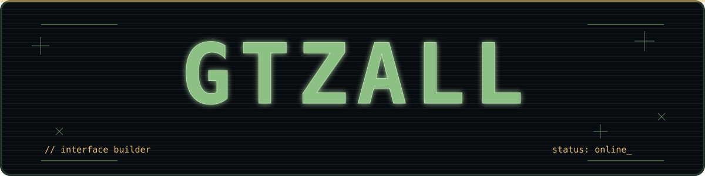
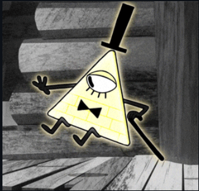

<table><tr><td colspan="2"><strong><code>$ whoami</code></strong></td></tr><tr><td width="72%" valign="top"><pre><code>&gt; Gustavo Almeida
&gt; Desenvolvedor web brasileiro
&gt; Explorando ideias através de código
&gt; Transformando interfaces em experiências
&gt;
&gt; foco: front-end · React · TypeScript</code></pre></td><td valign="top"><pre><code>STATUS

[ online ]
[ building ]
[ curious ]

&gt; stay curious_</code></pre></td></tr></table>

<h3><code>+ CURRENT PROCESS</code></h3>
<table><tr><td width="52%" valign="top">
<code>01</code> <strong>Aprendendo e construindo</strong>

☑ criando interfaces ☐ evoluindo meu portfólio ☐ estudando sistemas e redes ☐ publicando coisas boas

<code>&gt; ideias / código / realidade_</code>
</td><td valign="middle"></td></tr></table>

<h3><code>$ SELECTED WORK</code> → ver repositórios</h3>
<table><tr><td width="33%" valign="top"><a href="https://github.com/gtzall/web-portfolio"><strong>web-portfolio</strong></a> Meu portfólio pessoal  <code>JavaScript</code></td><td width="33%" valign="top"><a href="https://github.com/gtzall/calendario"><strong>calendario</strong></a> Experimento web  <code>JavaScript</code></td><td width="33%" valign="top"><a href="https://github.com/gtzall/tcc-v4"><strong>tcc-v4</strong></a> Projeto em construção  <code>TypeScript</code></td></tr></table>

<h3><code>+ STACK</code></h3>

<table><tr><td><strong>INTERFACE</strong> JavaScript · TypeScript HTML5 · CSS3 · React</td><td><strong>RUNTIME</strong> Node.js</td><td><strong>TOOLS</strong> VS Code · Git · GitHub</td><td><strong>ALWAYS</strong> learning...</td></tr></table>

<h3><code>+ ONLINE</code></h3>
<table><tr><td><a href="https://github.com/gtzall"><strong>◉ GitHub</strong></a> @gtzall</td><td><a href="https://web-portfolio-indol-nine.vercel.app/"><strong>◉ Portfólio</strong></a> web-portfolio-indol-nine.vercel.app</td><td><strong>◉ Contact</strong> aberto a boas ideias</td></tr></table>

<code>&lt;/&gt; obrigado por visitar · construindo um futuro interessante...</code>

