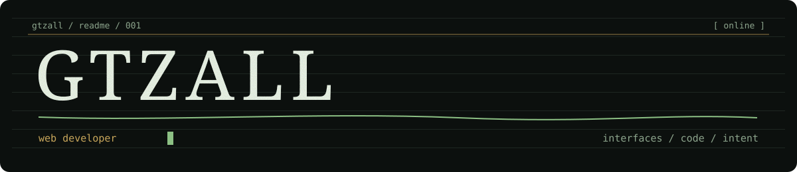

<table>
<tr><td colspan="2"><strong><code>$ quem sou eu</code></strong></td></tr>
<tr>
<td width="70%" valign="top">
<pre><code>&gt; Gustavo Almeida
&gt; desenvolvedor web brasileiro
&gt; construindo interfaces com personalidade
&gt; foco: front-end · React · TypeScript</code></pre>
</td>
<td valign="top"><pre><code>agora

[ aprendendo ]
[ construindo ]
[ testando ]

&gt; sem pressa_</code></pre></td>
</tr>
</table>

 

<table>
<tr>
<td width="62%" valign="top">
<h3><code></code></h3>

Gosto de transformar ideias em coisas que funcionam — páginas, experiências e pequenos experimentos que tenham alguma intenção por trás.

<code>01</code> interfaces que contam alguma coisa <code>02</code> código simples de entender <code>03</code> irei me tornar um programador full stack. 

</td>
<td width="38%" valign="middle" align="center">

</td>
</tr>
</table>

<h3><code>ferramentas que uso</code></h3>

<table>
<tr><td><strong>INTERFACE</strong> JavaScript · TypeScript HTML5 · CSS3 · React</td><td><strong>AMBIENTE</strong> Node.js VS Code · Git</td><td><strong>JEITO DE TRABALHAR</strong> curioso visual · direto</td></tr>
</table>

<h3><code>onde me encontrar</code></h3>

<a href="https://github.com/gtzall"><strong>GitHub</strong></a> &nbsp;·&nbsp; <a href="https://www.linkedin.com/in/gustavo-almeida-rodrigues"><strong>LinkedIn</strong></a> &nbsp;·&nbsp; <a href="https://web-portfolio-indol-nine.vercel.app/"><strong>Portfólio</strong></a>

<code>&lt;/&gt; feito por Gustavo · 2026</code>

