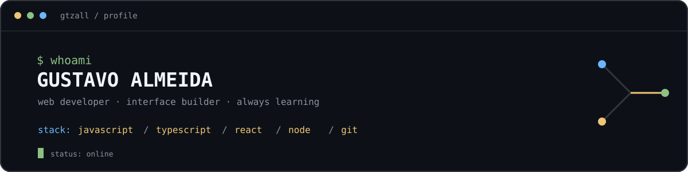

<p align="center">

  
  
</p>


<p align="center">

  <a href="https://github.com/gtzall"></a>
  
  <a href="https://web-portfolio-indol-nine.vercel.app/"></a>
  
</p>


<br>


```text

┌──(gtzall㉿github)-[~]

└─$ cat ./about-me.txt


  Gustavo Almeida — desenvolvedor web

  construindo interfaces, experimentos e coisas úteis para a internet.


  [ foco atual ]  front-end · experiências web · projetos próprios

  [ princípio  ]   menos ruído, mais intenção

```


## `01 / stack`


<p align="left">

  
  
</p>


| camada | ferramentas |

| --- | --- |

| **interface** | JavaScript · TypeScript · HTML5 · CSS3 · React |

| **runtime** | Node.js |

| **workflow** | VS Code · Git · GitHub |


## `02 / em andamento`


```console

$ git status

On branch main


Changes not staged for commit:

  modified:   ideias, interfaces e próximos projetos


nothing to commit — ainda.

```


No momento, estou evoluindo meu portfólio e criando projetos para transformar ideias em experiências web simples, rápidas e com personalidade.


## `03 / selected link`


```text

[01] portfolio

     ↳ https://web-portfolio-indol-nine.vercel.app/


[02] github

     ↳ https://github.com/gtzall

```


<p align="center">

  
  
</p>


<p align="center">

  <sub>built with curiosity · shipped with git · maintained by gtzall</sub>
  
</p>


